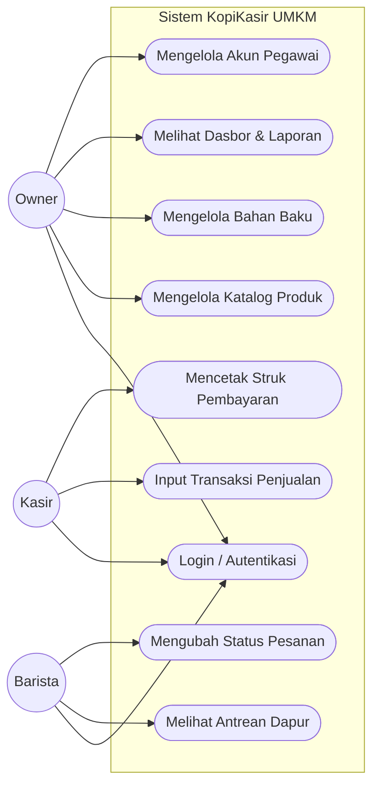
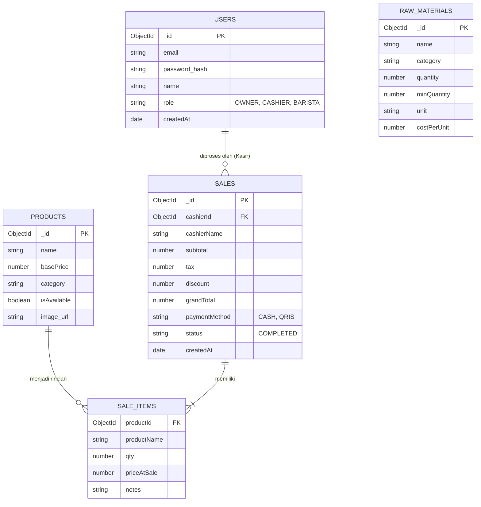
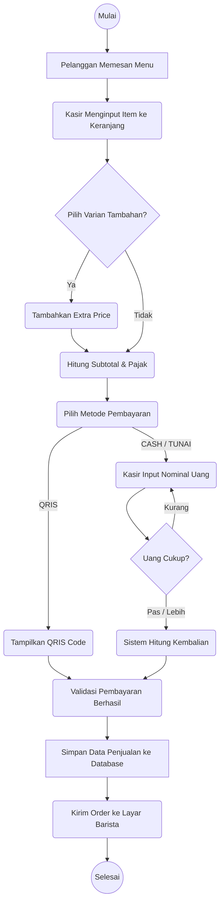
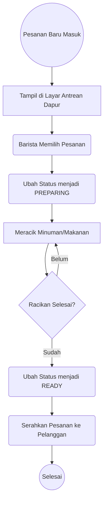

# LAMPIRAN DIAGRAM SISTEM
*Aplikasi KopiKasir UMKM*

Berikut adalah lampiran diagram pemodelan sistem (Use Case, ERD, dan Activity Diagram) yang dirender menggunakan format *Mermaid*. Diagram ini sangat penting untuk disertakan pada Bab II (Tinjauan Pustaka) atau Bab III (Metode Penelitian) dalam laporan skripsi/Capstone Anda.

> [!TIP]
> Jika Anda menyalin teks ````mermaid ... ```` ke dalam aplikasi seperti **Notion**, **GitHub**, **GitLab**, atau generator Markdown pendukung Mermaid lainnya, kode ini akan otomatis berubah menjadi gambar grafis diagram. 
> Anda juga dapat menyalin kodenya ke [Mermaid Live Editor (mermaid.live)](https://mermaid.live) untuk mengunduhnya sebagai file gambar (PNG/SVG) yang bisa disisipkan ke Microsoft Word.

---

## 1. Usecase Diagram
Diagram ini memodelkan interaksi antara Aktor (*Owner*, Kasir, Barista) dengan fungsi-fungsi di dalam batasan sistem.



---

## 2. Entity Relationship Diagram (ERD)
Diagram ini memodelkan rancangan basis data (*database*) NoSQL MongoDB yang digunakan dalam aplikasi.



---

## 3. Activity Diagram (Alur Transaksi Kasir)
Diagram ini menjabarkan alur aktivitas operasional saat Kasir melayani pemesanan pelanggan.



---

## 4. Activity Diagram (Alur Dapur / Barista)
Diagram ini menjabarkan alur aktivitas di dapur setelah pesanan masuk.


